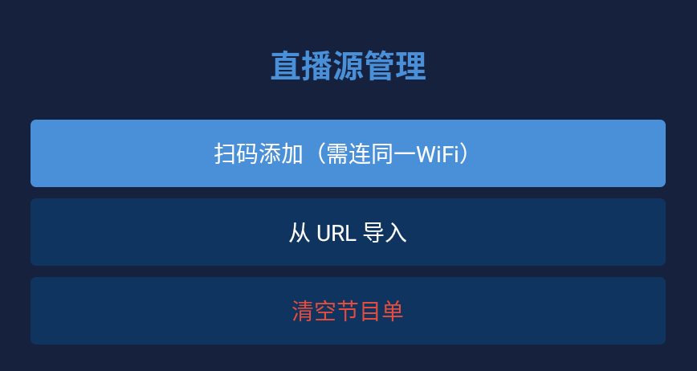

# TV-Live-Player

**Android TV 直播播放器，支持 M3U / TXT 直播源，可通过手机扫码配置。**

[**📥 下载最新版 APK**](https://github.com/xfgdck/TV-Live-Player/releases) | [**🐛 反馈问题**](https://github.com/xfgdck/TV-Live-Player/issues)

### 主要特性

**多源播放**：支持 M3U / TXT 格式直播源，同一频道可配置多个备用地址，自动换源。  
**手机扫码**：局域网内手机扫码即可添加 M3U 链接、单个频道或上传文件，无需在电视上输入。  
**分类管理**：按分类浏览频道，支持收藏、移动、删除等管理操作。  
**断流恢复**：播放中断自动重连，遍历所有备用 URL，尽可能保持播放。  
**远程遥控**：完美适配 Android TV 遥控器（方向键 / OK / 返回 / 菜单），同时也支持触摸屏操作。  

### 应用截图

### 使用方法

1. 前往 [Releases](https://github.com/xfgdck/TV-Live-Player/releases) 下载最新 APK
2. 安装到 Android TV 或电视盒子上
3. 打开应用，进入「源管理」→「手机扫码」/「手动输入」添加直播源 

